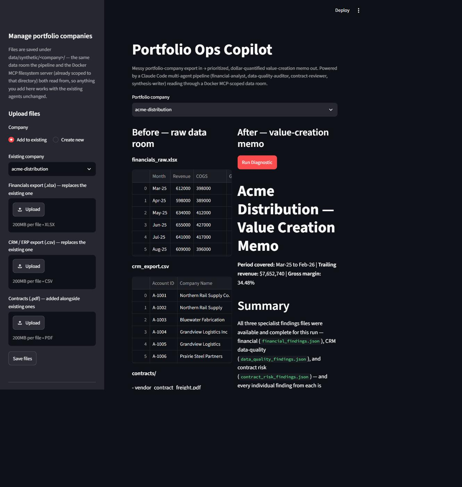
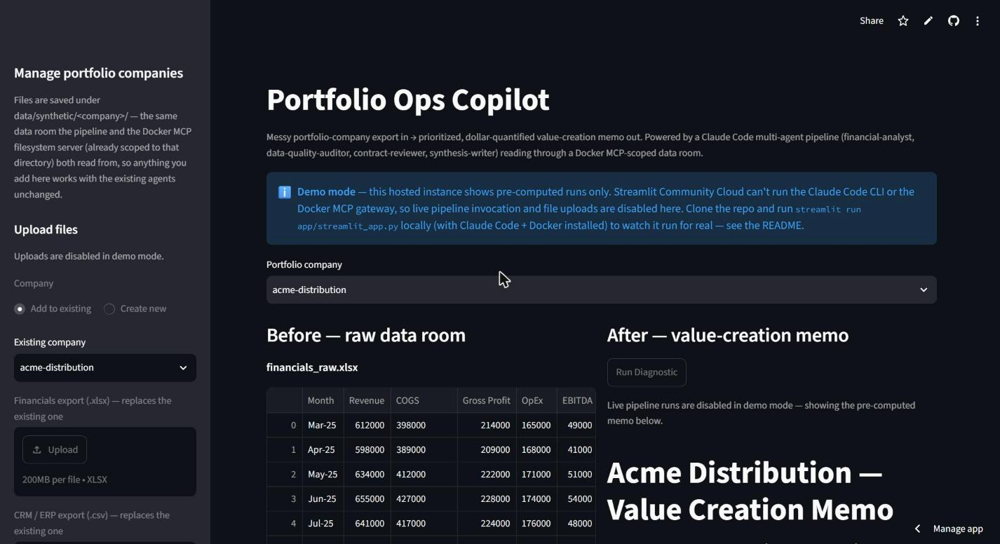
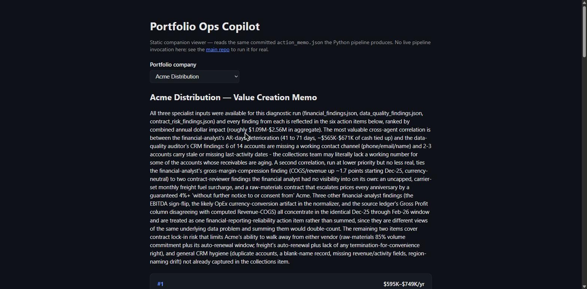
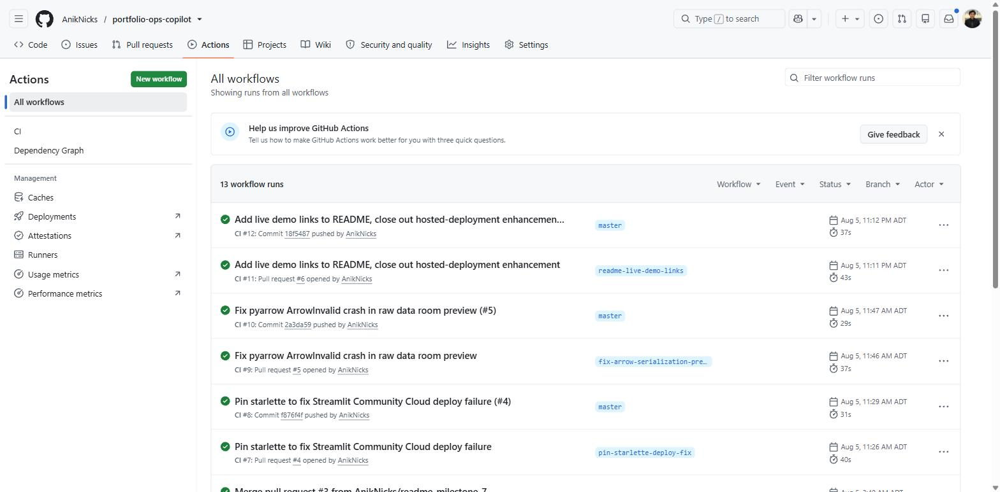
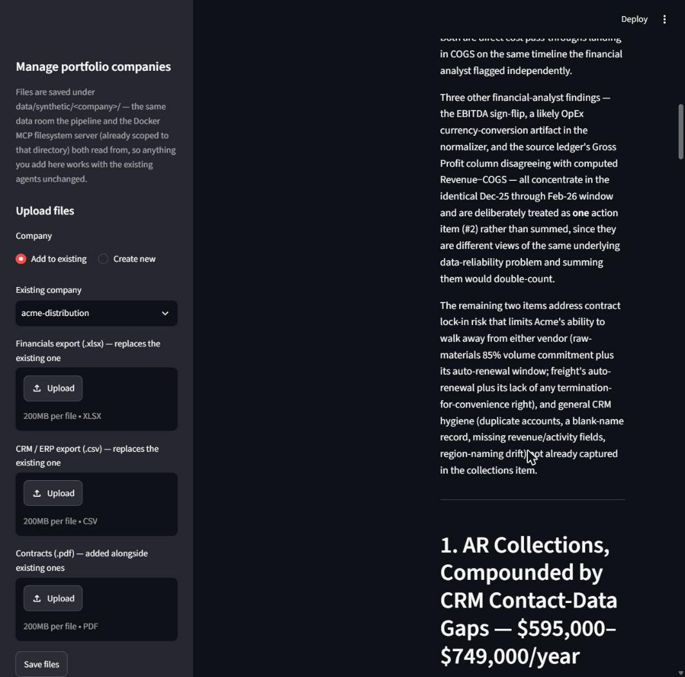
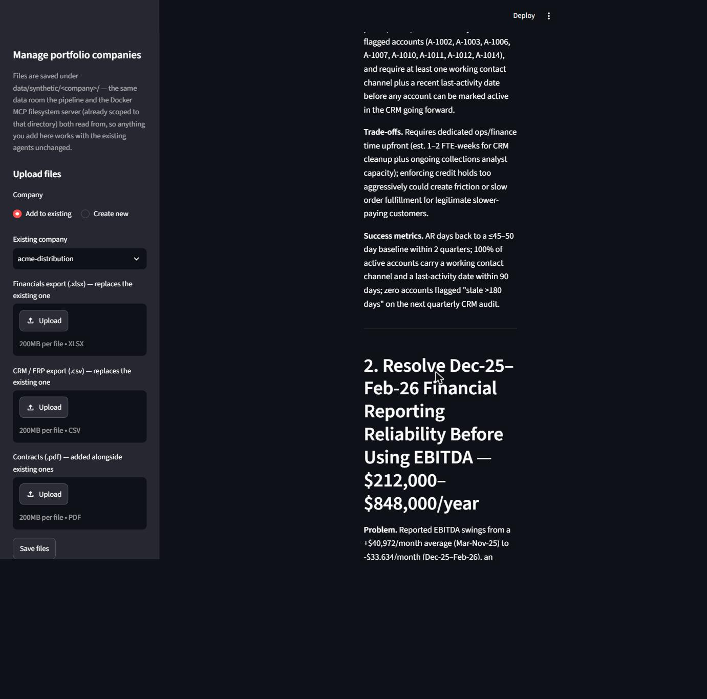

# 📊 Portfolio Ops Copilot: Autonomous Multi-Agent Portfolio Diagnostics Engine

[](https://github.com/AnikNicks/portfolio-ops-copilot/actions/workflows/ci.yml)

An advanced, production-grade autonomous diagnostics and value-creation orchestration platform
designed to convert a portfolio company's messy financial, CRM, and vendor-contract exports into a
board-ready, dollar-quantified action plan. **Portfolio Ops Copilot** orchestrates a four-agent
framework: three specialist agents running in parallel that independently mine financial ledgers,
CRM/ERP exports, and vendor contracts for risk signals, and a synthesis engine that correlates
their findings into a single prioritized memo.

Built natively using **Claude Code multi-agent orchestration**, the **Model Context Protocol**
(Docker MCP Toolkit), **Pydantic schema contracts**, and **pandas/pypdf** data-normalization
tooling, Portfolio Ops Copilot eliminates spreadsheet fatigue — instantly transforming
unstructured financial, CRM, and contract noise into a fixed
Problem→Solution→Trade-offs→Success-Metrics action plan with a dollar-impact estimate attached to
every recommendation, gated end-to-end by code-enforced validation instead of prompt-only trust.
The pipeline has been proven end to end against two independently-messy synthetic data rooms
(`acme-distribution`, `northwind-fabrication`) — not hand-tuned to a single example — and is
backed by an automated test suite (71 tests), a citation-grounding eval, and a green CI pipeline
on every push.

**Live demo:** [portfolio-ops-copilot.streamlit.app](https://portfolio-ops-copilot.streamlit.app/)
(full app in `DEMO_MODE` — pre-computed runs, uploads disabled) · [portfolio-ops-copilot.vercel.app](https://portfolio-ops-copilot.vercel.app/)
(static companion viewer for the generated memos)

---

## 📸 Screenshots

### Before / After Diagnostic Workspace


---

## 🌐 Live Demo & Deployment

Both halves of the app are deployed and publicly reachable — not just runnable locally. Screenshots
below are of the actual hosted instances, not the local dev server.

### Hosted Streamlit App (Streamlit Community Cloud, `DEMO_MODE`)

*Deployed straight from `master`; `DEMO_MODE=1` disables uploads and live pipeline invocation
since the hosted container has no Claude Code CLI or Docker MCP gateway — it serves the
already-committed output for both data rooms instead.*

### Static Companion Viewer (Vercel)

*A second, independent deployment of the Vite/React/TypeScript viewer — reads the same committed
`action_memo.json` the Python pipeline writes, with no backend and no cold start.*

### CI/CD in Production

*Real merged history, not a demo pipeline: every PR (including two deploy-time bugs found and
fixed live — an unpinned transitive `starlette` dependency and a `pyarrow` Arrow-serialization
crash — see [Engineering Notes](#-engineering-notes-shipping-to-production) below) went through a
green required `test` check before merge, enforced by branch protection on `master`.*

---

## ⚡ Core Features

* **Multi-Agent Diagnostic Pipeline:** Dispatches three specialist agents in parallel against a
  company's data room, each producing a schema-validated JSON findings file, then merges them
  through a synthesis agent that ranks every action item by dollar impact.
* **Code-Enforced Guardrail Gate:** A preflight checkpoint sanitizes the company input and
  confirms required source files exist before any agent is dispatched; a post-output checkpoint
  loads every agent's JSON against its Pydantic contract — including business-rule checks like
  impact-range ordering and closed enums — and retries a failing agent once (with the exact
  validation error appended to its prompt) before hard-stopping the run.
* **Retrieval-Only Contract Forensics:** The contract-review agent has no raw file-read tool at
  all — every clause it cites carries a `chunk_id` and a verbatim quote pulled from a dedicated
  PDF-chunking tool, eliminating paraphrased or hallucinated clause references by construction.
* **Cross-Agent Correlation Synthesis:** The synthesis agent actively looks for findings that
  reinforce each other across specialists (e.g., a contract pricing escalator that explains a
  COGS trend the financial agent flagged independently) and calls out the connection explicitly
  instead of listing three disconnected silos.
* **Least-Privilege Tool Scoping:** Every agent's tool allowlist is declared explicitly and scoped
  to the minimum it needs — the contract-review and data-quality agents have no generic file-read
  tool, enforced structurally in the agent definition, not just requested in a prompt.
* **Fail-Safe Regeneration Matrix:** The orchestrator clears stale output before every run so a
  no-read-tool agent's write never collides with the write-tool's overwrite-protection check —
  every diagnostic run is a clean, reproducible regeneration, never a stale partial merge.
* **Automated Quality Gates:** A 71-test pytest suite covering every schema, guardrail, and
  normalization edge case; an automated grounding eval that re-extracts every contract PDF fresh
  and verifies every cited clause; and a GitHub Actions CI pipeline (lint + format-check + test)
  required by branch protection before anything merges to `master`.
* **Run History & Observability:** Every diagnostic run is logged to a local SQLite history
  (company, grounding score, retry count, total dollar impact) — queryable via CLI or a "Run
  History" expander in the Streamlit app — purely for observability, never a gate on the run
  itself.

---

## 🛠️ Tech Stack

### Backend, Agentic Core & Orchestration
* **Claude Code** (Subagent & Task-Tool Orchestration)
* **Model Context Protocol / Docker MCP Toolkit** (Scoped, Read-Only Filesystem Access)
* **Pydantic** (Schema Contracts + Business-Rule Validation Engine)
* **pandas** (Financial Normalization Layer)
* **pypdf** (Contract Chunking & Citation Engine)

### Guardrails & Reliability
* **`pipeline/guardrails.py`** (Preflight Input Sanitization + Post-Output Validation CLI)
* **Retry-Once-Then-Hard-Stop Policy** (Self-Correcting Agent Dispatch on Validation Failure)
* **`evals/grounding_eval.py`** (Automated Citation-Grounding Verifier)
* **SQLite `pipeline/run_history.py`** (Per-Run Observability Log)

### Testing & CI
* **pytest** (71-test suite: schemas, guardrails, normalization, contract extraction, run history)
* **ruff** (Lint + Format, enforced both locally via pre-commit and in CI)
* **GitHub Actions** (Lint → Format-Check → Test, required by branch protection on `master`)

### Frontend & App State
* **Streamlit** (Before/After Diagnostic Visualization Console, with a `DEMO_MODE` read-only mode)
* **Vite + React + TypeScript** (`viewer/` — a static, backend-free companion viewer for already-
  generated memos)

---

## 📐 Project Architecture

```text
                    +-------------------------------+
                    |     /diagnose <company>       |
                    |   (Orchestrator, .claude/)     |
                    +---------------+-----------------+
                                    |
                                    v
                    +---------------+-----------------+
                    |   ① Preflight Guardrail Check   |
                    |  slug sanitized, inputs present  |
                    +---------------+-----------------+
                                    |
                    +---------------+-----------------+
                    |     Parallel Task Dispatch       |
                    +----+-------------+-------------+-+
                         |             |             |
                         v             v             v
                  [financial-    [data-quality-  [contract-
                    analyst]        auditor]      reviewer]
                         |             |             |
                         v             v             v
                  financial_    data_quality_   contract_risk_
                  findings.json  findings.json   findings.json
                         |             |             |
                         +-------------+-------------+
                                    |
                                    v
                    +---------------+-----------------+
                    |  ② Post-Output Guardrail Check  |
                    |  schema + business-rule validate |
                    |  retry once, else hard-stop      |
                    +---------------+-----------------+
                                    |
                                    v
                    +---------------+-----------------+
                    |        synthesis-writer          |
                    |   (cross-agent correlation)       |
                    +---------------+-----------------+
                                    |
                    (② guardrail re-applied to the final memo JSON)
                                    v
                    +---------------+-----------------+
                    |  action_memo.json  +  <company>  |
                    |   _value_creation_memo.md        |
                    +-----------------------------------+
```

---

## 🖼️ Interface Matrix

| Cross-Agent Correlation | Fixed Memo Format |
|:---:|:---:|
|  |  |
| *Synthesis agent tying an independently-flagged financial trend to a contract clause.* | *Every action item enforces Problem → Solution → Trade-offs → Success Metrics.* |

---

## 💻 Installation

### 1. Clone the Repository

```bash
git clone https://github.com/AnikNicks/portfolio-ops-copilot.git
cd portfolio-ops-copilot
```

### 2. Create and Activate a Virtual Environment

#### Windows

```bash
python -m venv venv
venv\Scripts\activate
```

#### macOS/Linux

```bash
python3 -m venv venv
source venv/bin/activate
```

### 3. Install Dependencies

```bash
pip install -r requirements.txt
```

To run the test suite, lint, or pre-commit hooks locally, also install the dev extras:

```bash
pip install -r requirements-dev.txt
pre-commit install   # optional: runs ruff on every commit
```

### 4. Configure the Model Context Protocol Gateway

`.mcp.json` is checked in, but it points at a Docker MCP **profile**
(`portfolio-ops-copilot`) that lives on your machine, not in the repo, so a fresh clone needs to
recreate it once:

```bash
docker mcp profile create --name "Portfolio Ops Copilot" --id portfolio-ops-copilot \
  --server catalog://mcp/docker-mcp-catalog/filesystem
docker mcp profile config portfolio-ops-copilot --set 'filesystem.paths=["<absolute-path-to-repo>/data/synthetic"]'
docker mcp client connect claude-code --profile portfolio-ops-copilot
```

On Windows, configure `filesystem.paths` as a POSIX-style path **without** a drive letter (e.g.
`/Users/<you>/.../data/synthetic`) — a Windows-style path collides with Docker's `-v src:dst` bind
syntax on the drive-letter colon. Then fill in the two `<ABSOLUTE_PATH_...>` placeholders in
`.mcp.json`'s `env` block with your own machine's paths.

---

## 🚀 Running the Application

### 5. Run a Full Diagnostic

```bash
claude
/diagnose acme-distribution
```

Two synthetic data rooms ship with the repo — `acme-distribution` and `northwind-fabrication`
(`data/synthetic/<company>/`) — proving the pipeline generalizes rather than being hand-tuned to
one example. Run either the same way: `/diagnose northwind-fabrication`.

### 6. Launch the Visualization Console

```bash
streamlit run app/streamlit_app.py
```

1. Select a portfolio company from the sidebar (or upload a new company's financials, CRM export,
   and contract PDFs).
2. Review the raw data room in the **Before** panel.
3. Click **Run Diagnostic** to stream the live multi-agent run, then review the generated
   value-creation memo in the **After** panel.
4. Expand **Run History** to see every past run's grounding score, retry count, and total dollar
   impact, pulled from the local SQLite log.

Set `DEMO_MODE=1` to run the app read-only (uploads, file removal, and re-running a diagnostic are
disabled; only already-committed output is browsable) — the mode this app runs in on a public
hosted demo, so a visitor can't shell out to the `claude` CLI on the host.

### 7. Run the Companion TypeScript Viewer (optional)

A second, backend-free way to browse already-generated memos — a static Vite + React + TypeScript
site that reads the same `output/<company>/action_memo.json` the Python pipeline writes, with no
Python runtime or cold start:

```bash
cd viewer
npm install
npm run dev
```

It runs alongside the Streamlit app, not instead of it — Streamlit is the "watch it run" story
(uploads, live `/diagnose` streaming); the viewer is the "read the results" story (fast, always
warm, read-only by construction since it never invokes the pipeline).

---

## 🛡️ Guardrails & Reliability Engineering

Schema conformance is enforced by code, not by asking an LLM nicely. `pipeline/schemas.py` defines
a Pydantic contract for every inter-agent handoff, and `pipeline/guardrails.py` is the CLI the
orchestrator actually runs and branches on:

* **Preflight** — rejects a company slug that doesn't match `^[a-z0-9][a-z0-9-]*$` (the value gets
  interpolated into file paths and shell commands, so this blocks path-traversal/injection before
  it reaches a dispatch), and confirms the required source files exist.
* **Post-output validation** — loads the target JSON and validates it against its Pydantic model
  for real, including business-rule checks (`dollar_impact_high >= dollar_impact_low`, closed
  `Literal` enums instead of free strings, non-empty required fields). On failure, the orchestrator
  re-dispatches the single failing agent once with the validation error appended to its prompt; a
  second failure hard-stops the run and reports exactly which agent and field broke.

This is a real, load-bearing gate rather than a formality — during an end-to-end run, it caught a
specialist agent (deliberately scoped with no read access to the schema file) producing a
differently-shaped JSON document, and forced a corrected retry before synthesis was allowed to run.

Two more checks run alongside the schema gate, both re-derived from source on every run rather
than cached or trusted from a prior pass:

```bash
# Re-extracts every contract PDF fresh and verifies every cited chunk_id/quoted_text is real
python evals/grounding_eval.py --company acme-distribution   # GROUNDING_OK, 6/6 (100%)

# Full test suite (schemas, guardrails, normalization, contract extraction, run history)
pytest -q                                                     # 71 passed

# Lint + format, the same checks CI runs and branch protection requires before merge
ruff check . && ruff format --check .
```

---

## 🧪 Diagnostic Scenario Matrix

### 1. AR Collections Compounded by CRM Contact Gaps (Critical Priority)

* **Finding Reference:** `AR-COLLECT-01`
* **Signal Surface:** Accounts-receivable aging (financial agent) cross-referenced with missing
  CRM contact channels and stale last-activity dates on the same accounts (data-quality agent).
* **Correlation Target:** Verifies the synthesis agent's ability to tie a financial trend to a data
  hygiene root cause instead of reporting them as two unrelated line items. Estimated impact:
  $595,000–$749,000/year.

### 2. Margin Compression Explained by a Contract Escalator (High Priority)

* **Finding Reference:** `MARGIN-ESC-01`
* **Signal Surface:** Gross-margin compression (financial agent) correlated with a compounding
  annual pricing escalator and an 85% volume-lock-in clause on a raw-materials contract
  (contract-review agent).
* **Correlation Target:** Confirms retrieval-only contract citation (`chunk_id` + verbatim quote)
  is precise enough to ground a dollar estimate instead of a directional guess. Estimated impact:
  $180,000–$450,000/year.

### 3. CRM Duplicate & Schema-Drift Cleanup (Standard Priority)

* **Finding Reference:** `CRM-HYGIENE-01`
* **Signal Surface:** Duplicate accounts under separate IDs, a blank-name record fragment, and
  inconsistent region-naming conventions across a CRM export.
* **Correlation Target:** Confirms every finding carries a traceable Account ID in its evidence
  list rather than an unverifiable summary claim.

### 4. AR Days & COGS Compression on a Second, Differently-Messy Data Room (`northwind-fabrication`)

* **Signal Surface:** AR days climbing from 38 to 65 over a year (financial agent), cross-referenced
  against CRM contact gaps on the same accounts; gross margin falling ~6.5 points as COGS rose,
  correlated against an uncapped 6% annual price escalator with a broken termination
  cross-reference on a raw-materials supply contract (contract-review agent).
* **Correlation Target:** Proves the pipeline generalizes to a second data room with entirely
  different underlying numbers and messiness patterns — not hand-tuned to `acme-distribution` —
  while still producing traceable, retrieval-grounded cross-agent correlations. Grounding eval:
  6/6 (100%). Estimated impact: $650,000–$850,000/year (AR days) and $560,000–$700,000/year
  (COGS/EBITDA).

---

## 🛠️ Engineering Notes: Shipping to Production

Getting to a live, publicly-reachable deployment surfaced two real bugs that never showed up in
local development or CI — both root-caused, fixed, and shipped through the same PR + required-
CI-check workflow as every other change in this repo, not patched ad hoc:

* **Unpinned transitive dependency broke the hosted runtime.** `requirements.txt` pinned
  `streamlit` exactly but not its `starlette` dependency. Every Streamlit Community Cloud deploy
  installs fresh, so it resolved a newer `starlette` release with a breaking `GZipResponder`
  signature change that `streamlit==1.60.0` calls incorrectly — `TypeError` on startup. Invisible
  locally because an older, compatible `starlette` was already installed from earlier work. Fixed
  by pinning `starlette==1.3.1` explicitly ([PR #4](https://github.com/AnikNicks/portfolio-ops-copilot/pull/4)).
* **A silent Arrow-serialization crash, found by reading the production logs after deploy.**
  Rebooting the app after the fix above surfaced a second, unrelated failure: `st.dataframe()`
  was throwing `pyarrow.lib.ArrowInvalid` on every page load. Root cause: the raw data rooms are
  *deliberately* messy (an uncomputed `"601000*0.651"` formula string sitting in a COGS column,
  a comma-formatted `"894,000"` in a Revenue column), which pandas parses as `object` dtype —
  something Streamlit's Arrow serializer can't convert, and something the existing `try/except`
  around the call never caught, because the failure happens inside Streamlit's own serialization
  path, not the wrapped script code. Reproduced deterministically with `pa.Table.from_pandas()`
  before writing the fix, verified clean against both data rooms' raw exports after
  ([PR #5](https://github.com/AnikNicks/portfolio-ops-copilot/pull/5)).

The common thread: neither bug was catchable by the test suite or CI as they existed — both only
appear when a fresh environment resolves dependencies for real, or when Arrow serialization runs
against actual messy data at render time. Both are now regression-proof in the sense that matters
for this repo — pinned, fixed, and merged behind a green required check — but the honest lesson is
that "tests pass, CI is green" and "the deployed app actually works" are different claims, and only
one of them is provable without deploying.

---

## 🔮 Future Enhancements

* **Additional Specialist Agents:** A dedicated churn/retention-risk agent and a vendor-pricing
  benchmarking agent, dispatched into the same parallel Task-tool fan-out.
* **Live Data-Room Connectors:** Secured MCP connectors into real ERP/CRM systems, replacing the
  synthetic data room while keeping the same normalize-before-reasoning tool boundary.
* **Automated Remediation Ticketing:** Auto-filing a ticket per ranked action item into an issue
  tracker, with the dollar-impact estimate and evidence carried into the ticket body.

---

## 🔗 Repository & Meta

* **GitHub Repository:** [https://github.com/AnikNicks/portfolio-ops-copilot](https://github.com/AnikNicks/portfolio-ops-copilot)
* **Author Profile:** [Anik Das (AnikNicks)](https://github.com/AnikNicks)
* **License:** This project is open-source and intended for technical portfolio, research, and
  educational purposes.

---

## 🤝 Acknowledgements

* Anthropic Claude Code Multi-Agent Framework
* Docker MCP Toolkit / Model Context Protocol
* Pydantic Validation Ecosystem
* Streamlit Visualization Framework
